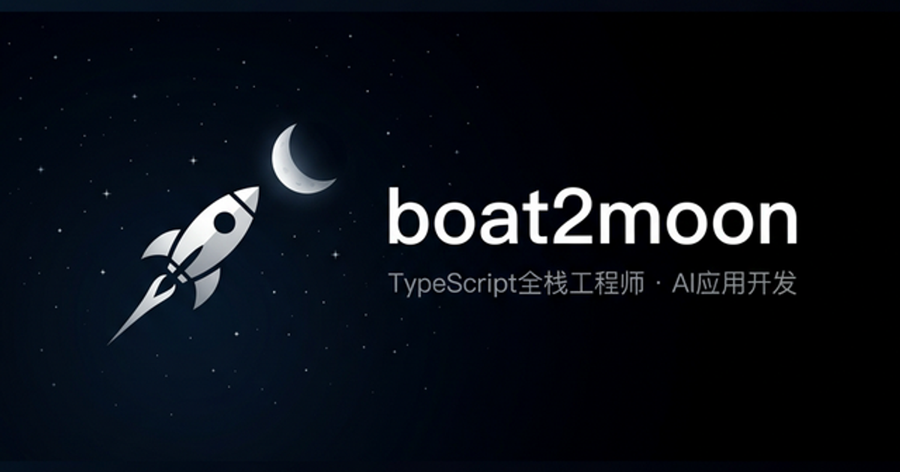

  
  <table border="0" cellpadding="0" cellspacing="0" style="border-collapse: collapse; border: none; width: 100%;">
    <tr>
      <td width="42%" align="center" valign="middle" style="border: none; padding-right: 25px;">
        <h2 style="margin: 0 0 10px 0;">👋 Hello~ 我是于淼</h2>
        <strong>211院校计算机-人工智能专业硕士</strong> 
        <strong>👨🏻‍💻 角色: JS/TS 全栈开发 | AI 应用开发</strong>
        

          &nbsp;
        

      </td>
      <td width="58%" align="center" valign="middle" style="border: none; border-left: 1px solid #555; padding-left: 25px; color: #888;">
        
          我是一名AI复合型程序员，熟悉 TS 前后端开发生态，实现 A/B/C 端业务闭环。了解项目工程化及 CI/CD 流程，并具有一定交叉行业不同场景下 AI 算法和应用调优经验，热衷于 AI 应用全栈开发。
        
      </td>
    </tr>
  </table>

 

### 🛠️ 技术栈

**编程语言：** &nbsp;   

> 主 JavaScript / TypeScript，副 Python

**熟悉前端：** &nbsp;         

> HTML，Sass / Tailwind CSS，工程化，组件库，状态管理，React 与 Next 框架，富文本编辑器开发

**熟悉 AI 应用开发：** &nbsp;     

> LangChain.js，Vercel AI-SDK，Prompt 工程与应用，知识工程与 RAG，Agent 理论与框架

**了解后端：** &nbsp;             

> Node / Hono / Nest，Next 实现 BFF 架构，ORM 与 关系型/内存/向量数据库，消息队列

**CI/CD 应用：** &nbsp;    

> Docker，GitHub Actions / Webhooks，Serverless，Edge Runtime
